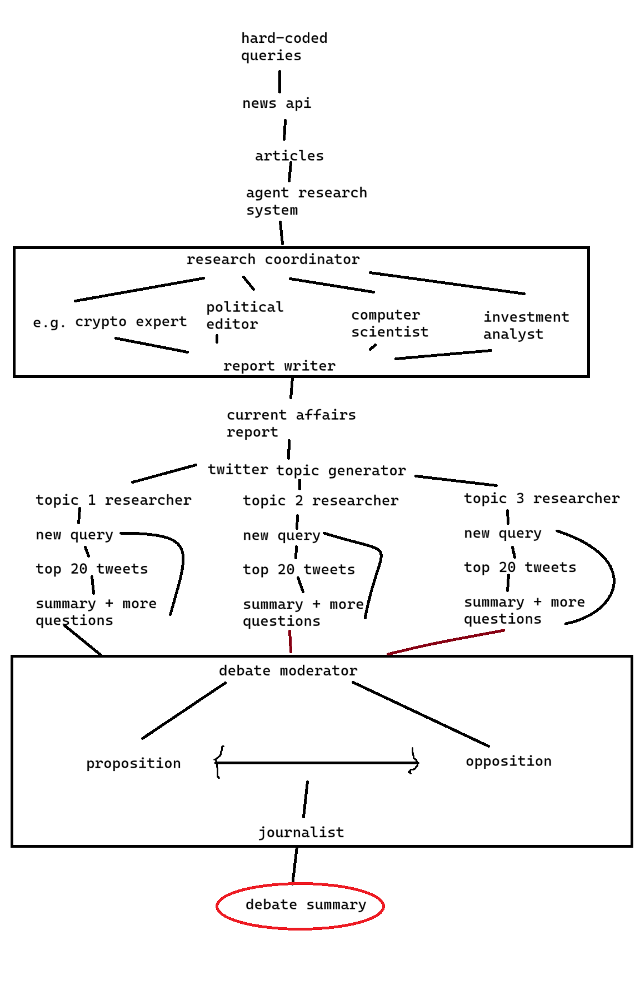

# NewsCrypt

## Fancy-encrypted chat forum paired with adversarial agentic AI debate analyser

## [We're live on https://newscrypt.xyz.](https://newscrypt.xyz/)

### Check out our introductory talk [here](https://drive.google.com/file/d/1H5CLXefKrCkjH0XLXt9Et8sOOPzzZzjm/view?usp=drive_link).

_As with any project developed in around 36 hours by just two people, NewsCrypt is not entirely 100% bug free... or even close to it. But we're hoping that by watching our introductory talk you'll understand where we're coming from and why we believe our idea is revolutionary!_

### USPs at a glance 

 - **HUMAN Handshake** - revolutionary cryptography-powered combined authentication and liveness verification method
 - **Forums** for discussing views - not just letting the big names talk
 - **Powerful, knowledge-backed agential AI** consisting of 24 agents playing 12 roles to digest around 120 Tweets and 15 articles to create every single debate summary
 - **Truly decentralised** with live translation features for all text, features, and conversations on the website powered by our AI, to empower collaboration of thoughts from around the world

Our project is a submission to **Torus' Twitter Debate Analyser** and to the **Main Track cryptography competition**. Therefore, the main premise of the site is a breakdown of
ongoing debates on Twitter, which we extract through their API and feed through a series of 24 individually-configured
self-adverserial AI agents in order to provoke the best points of debate. Hundreds of real-world data-points, including
both Tweets and articles from the news, are fed into these agents, so as to ensure they base their judgements on
rational decision-making and evidence. We then present this in a user-friendly format on a website with a combined
retro-futuristic aesthetic.

The USP of our site compared to other submissions is our commitment to openness: we don't accept that the most popular
accounts should automatically be the decision-makers on issues. We therefore introduce a forum feature on the website,
allowing users to chat and discuss their thoughts amongst themselves. In order to prevent spam, we invented a brand-new
way of interacting with the forum, by having users sign in with their biometric likenesses (know as the HUMAN Handshake), thereby serving as both a
means of authentication and of liveness detection simultaneously (and also just a crazy-fun login flow!). This is
achieved through locality-sensitive hashing and multiple rounds of encryption, in order to prevent biometrics from ever
actually reaching the server.

One of our biggest priorities was breaking down barriers and expanding access. That's why out website features full internationalisation, with auto-translation of all messages and analyses published, powered by AI. This sets us apart from the competition who think crypto is reserved for the Anglosphere - we're here to bring together minds from around the world for a truly decentralised society.

We're really proud of what we've built, and hope you find it cool too. Check it out on newscrypt.onrender.com or
newscrypt.xyz.